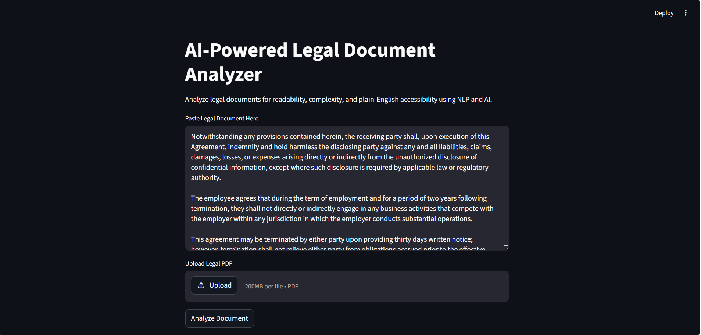
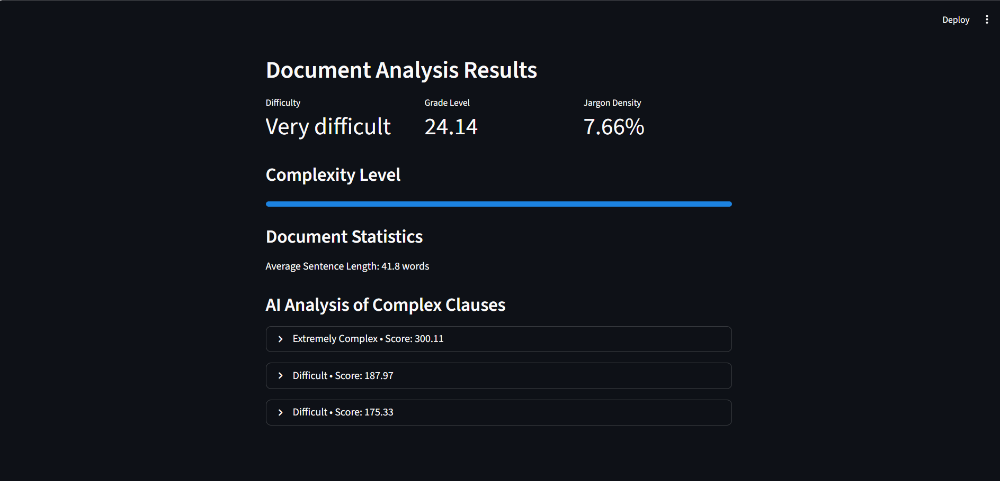
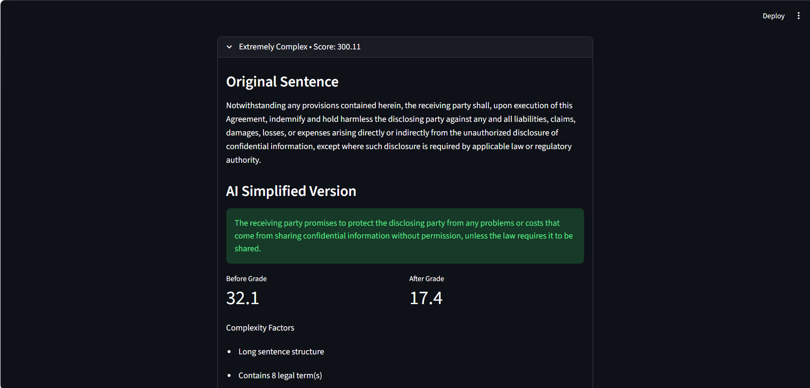

# AI-Powered Legal Document Analyzer

An AI-powered NLP application that analyzes legal documents for readability, complexity, and accessibility. The system identifies difficult legal clauses, detects jargon-heavy content, and uses a large language model (LLM) to simplify legal text into plain English while preserving meaning.

The project is designed to improve legal accessibility for users who may struggle to understand contracts, agreements, privacy policies, and other legal documents.

---

## Features

- Readability and complexity scoring
- Legal jargon detection
- Complex clause ranking
- AI-powered legal text simplification
- PDF upload support
- Explainable NLP analysis
- Readability improvement tracking
- Interactive Streamlit interface

---

## Tech Stack

- Python
- Streamlit
- spaCy
- NLTK
- Textstat
- PyPDF2
- Groq API
- LLaMA 3.1
- NLP (Natural Language Processing)

---

## System Workflow

```text
Input Legal Document
        ↓
Text Preprocessing
        ↓
Readability & Complexity Analysis
        ↓
Legal Jargon Detection
        ↓
Complex Clause Ranking
        ↓
AI-Powered Simplification
        ↓
Quality Validation
        ↓
Interactive UI Output
```

---

## Screenshots

### Home Interface



---

### Document Analysis Dashboard



---

### AI Clause Simplification



---

## Installation & Setup

### Clone the repository

```bash
git clone <your-github-repository-link>
cd legal-document-analyzer
```

### Install dependencies

```bash
pip install -r requirements.txt
```

### Set Groq API Key

#### Windows PowerShell

```powershell
$env:GROQ_API_KEY="your_api_key"
```

### Run the application

```bash
streamlit run streamlit_app.py
```

---

## Future Enhancements

- Clause risk detection
- Downloadable PDF analysis reports
- Multi-language legal simplification
- OCR support for scanned legal documents
- Highlighting difficult clauses directly in uploaded documents

---

## Project Type

AI + NLP + LegalTech + Accessibility

---

## Author

Ananya Paniraj